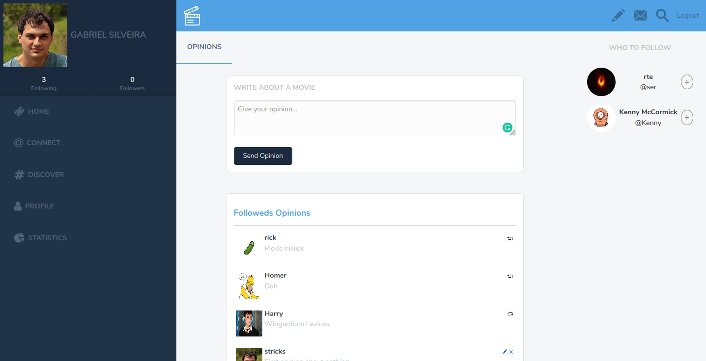
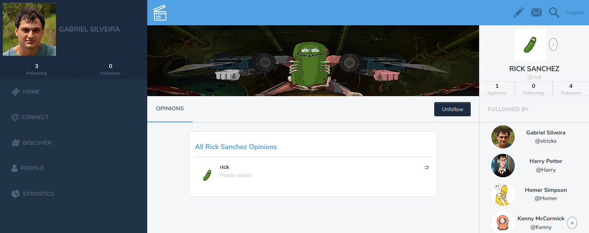

# Ruby on Rails Capstone Project.

In this project, I redesigned a twitter to create opinions about movies. I used a lot of knowledge acquired throughout the Ruby on Rails section, Model/View/Controller concepts, some of bootstrap from previous HTML & CSS, among other knowledge acquired on Microverse to create an MVP for this app.

The project consists of a Sing up/Login with username as the login information (as required). The user has a photo to show on his profile/opinions and a cover image that shows on his profile. The images should be provided as URL because I can't store images on heroku database. If no image is informed, or an invalid URL the app will show a default one instead.

Without logging in the user can see all user's opinions on a central 'timeline' and on the right a list of users who are registered. 

Logged in the user see a timeline with only opinions of the ones he follows and his own opinions. On that timeline, he can edit/delete his own opinions and on other user's opinions, he can 'retweet' (the created copied opinion will have a link for the original user who created it).

There is another view for the user profile, that shows a cover image above the specific user opinions and profile information on the right.

The functionality to follow/unfollow is very intuitive. '+' buttons to follow close to not followed users are shown as well as an explicit button to follow/unfollow on the profile user

# Screen Home Page

## Main Page


## User Page



## Built With

   - Ruby,
   - Ruby on Rails,
   - SCSS,
   - Bootstrap,
   - Font Awesome,
   - RSpec(Testing)
   - Capybara(Testing)
   - Bullet(Developing)

## Live Demo

[Live Demo Link](https://bearded-toonie-16990.herokuapp.com/)

## Video Presentation

[Project Presentation](https://www.loom.com/share/3c752e01c5904c7785cb4167621e700e)

## Getting Started

You can get a local copy of the repository please run the following commands on your terminal:

```
$ cd <folder>

$ git clone git@github.com:Stricks1/cap-twitter.git
```

You need to install the required gems:

```
$ bundle install
```

Migrate the database

```
$ rake db:migrate
```

If you want to prepopulate the database you can run the seed.rb file(not required):

```
$ rake db:seed
```

And run the server:

```
$ rails server
```


To navigate on the app you can enter http://localhost:3000/ on your browser, set a new User and you are ready to log in.

## Tests

The tests were created with RSpec, to run the tests you should open the app folder on console and run 
 
```
$ rspec
```

It will run the 3 test files:

- spec/feature/features_spec.rb
- spec/models/following_spec.rb
- spec/models/user_spec.rb

## Authors

👤 **Author**

Gabriel Malheiros Silveira

- Github: [@Stricks1](https://github.com/Stricks1)
- E-mail: [Gabriel Silveira](mailto:gmalheiross@gmail.com)
- Linkedin: [Gabriel Silveira](https://linkedin.com/in/gabriel-malheiros-silveira/)
- Twitter: [@Gabriel_Stricks](https://twitter.com/Gabriel_Stricks)

## 🤝 Contributing

Contributions, issues and feature requests are welcome!

Feel free to check the [issues page](issues/).

## Show your support

Give a ⭐️ if you like this project!

## Acknowledgments

   - Project Capstone from Microverse HTML & CSS curriculum
   - Design idea (layout, colors, font) was inspired by Gregoire Vella, you can find the original idea on [Behance](https://www.behance.net/gregoirevella)
